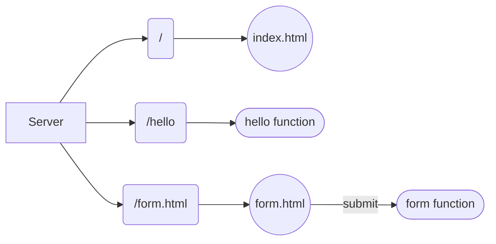

# simple-webserver-with-go
Building a simple webserver using Golang

```mermaid
graph LR;
Server --> index_path(/) --> index((index.html))
Server --> hello_path(/hello) --> hello_function([hello function])
Server --> form_path(/form.html) --> form((form.html)) --submit--> form_function([form function])
```

Run `go build` do build application and run `go run main.go` to start application
