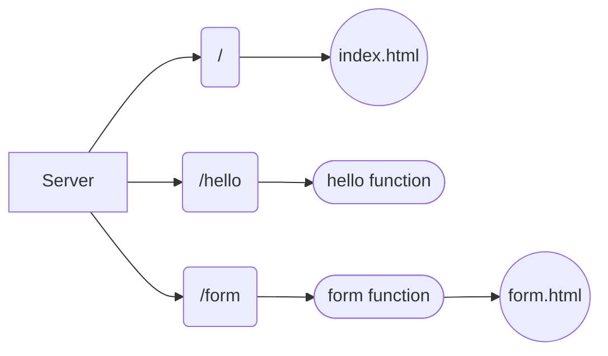

# simple-webserver-with-go
Building a simple webserver using Golang

```mermaid
graph LR;
Server --> index_path(/) --> index((index.html))
Server --> hello_path(/hello) --> hello_function([hello function])
Server --> form_path(/form) --> form_function([form function]) --> form((form.html))
```
